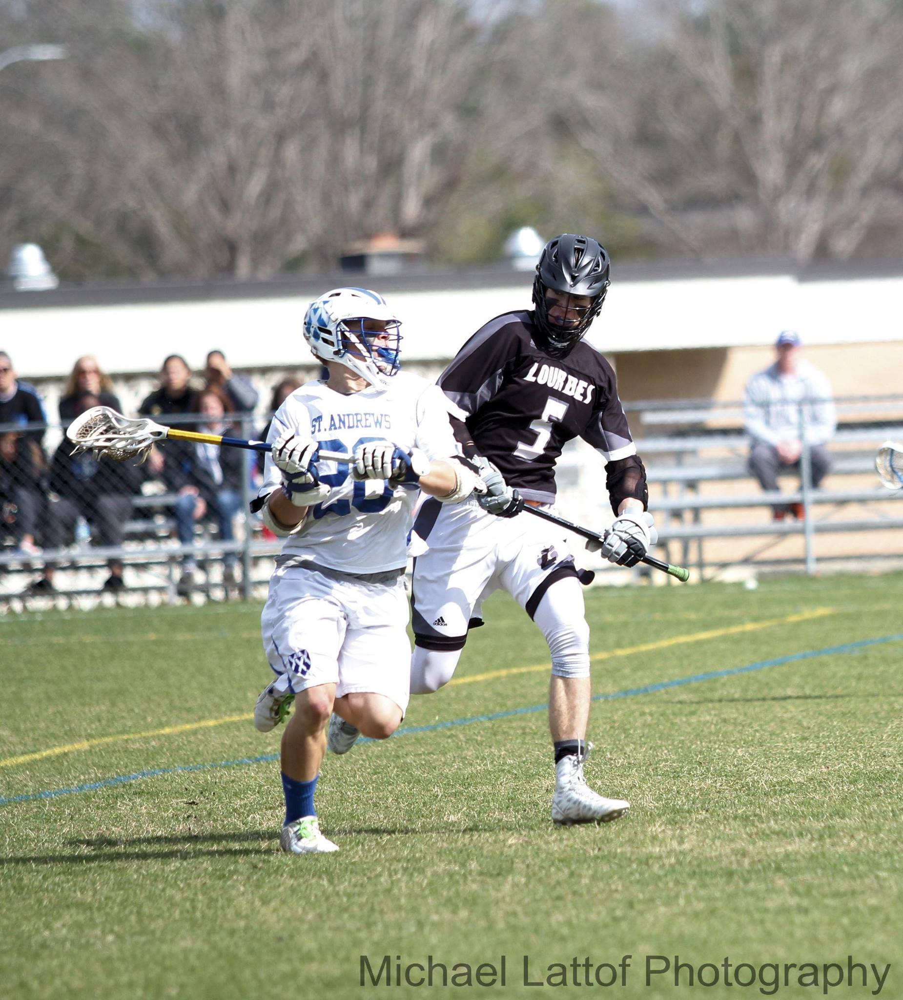

Hello, my name is Cha'Sed Miller, yes i know its weird, i am a 23 year old college graduate working to do what i love with who i love. I LOVE the sport of lacrosse i've played it for 9 years including 4 years of college experience at St.Andrews University. 

Awards:
Senior year
	First team all american
	First team all confrence
	St.Andrews MVP
	Timothy J.olthoff Art Scholarship
Junior Year
	Honorable mention all american
	First team all confrence
Sophmore Year
	Honorable mention all confrence

I got my major in game design with a concentration in Comp. Sci. with a minor in chemisty. I started out wanting to be a chemisty teacher but quickly realized that teaching was not for me. I took a couple game design classes for the first 2 years of school and decieded to pursure that instead.

<!-- This is the base Jekyll theme. You can find out more info about customizing your Jekyll theme, as well as basic Jekyll usage documentation at [jekyllrb.com](https://jekyllrb.com/)

You can find the source code for the Jekyll new theme at:
 /
[minima](https://github.com/jekyll/minima)

You can find the source code for Jekyll at
 /
[jekyll](https://github.com/jekyll/jekyll) -->
